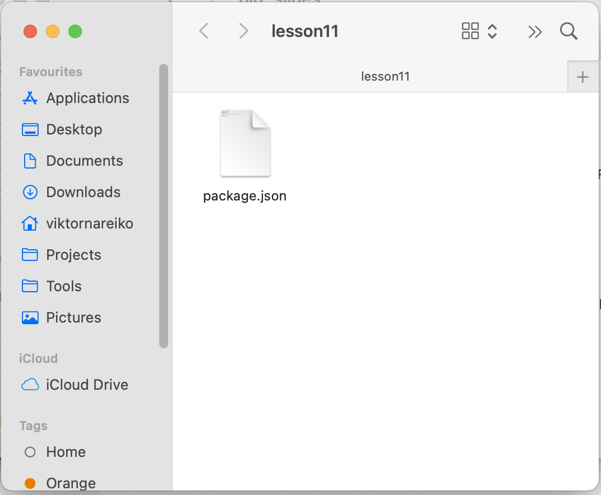
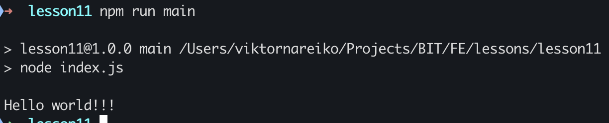

# Execute script in node environment

Node.js is a JavaScript runtime built on Chrome's V8 JavaScript engine.

* Go to  [https://nodejs.org/en/](https://nodejs.org/en/) and download latest LTS nodejs version. Install it.
* In your project directory create a new folder (e.g. test_node) got to this folder, open cmd and execute:

```bash
npm init
```

you should see:



create file index.js and write:

```js
console.log("Hello world!!!");
```

open package.json file and add

```js
{
  "name": "lesson11",
  "version": "1.0.0",
  "description": "",
  "main": "index.js",
  "scripts": {
    "main": "node index.js",
    "test": "echo \"Error: no test specified\" && exit 1"
  },
  "author": "",
  "license": "ISC"
}
```

run:

```bash
npm run main
```

you should see:

